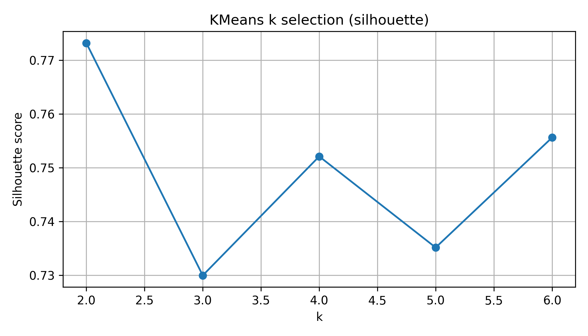
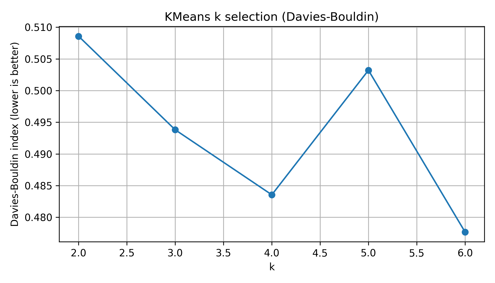

# FlareWatch CA3 - интерактивный мониторинг газового факельного сжигания (KAZ, UZB, TKM)

**FlareWatch CA3** - минимально воспроизводимый (MVP) пайплайн для анализа спутниковых детекций газовых факелов в Центральной Азии (Казахстан, Узбекистан, Туркменистан) 
Результат: **кластеризация объектов**, интерпретируемая шкала **Low/Medium/High**, **top-alerts** и **интерактивная карта**.

---

## Быстрый старт

### Вариант A: Colab
1. Открой ноутбук: `notebooks/Aero_space_competition.ipynb`
2. Загрузите исходные CSV EOG в `/content/`:
   - `eog_global_flare_survey_YYYY_flare_list.csv`
   - `eog_global_flare_survey_YYYY_country_summary.csv`
3. Запусти ячейки сверху вниз - все артефакты автоматически сохраняются в `outputs/`.

**Colab:** [Open in Colab](PASTE_COLAB_LINK_HERE)

### Вариант B: просто посмотреть демо
Открой `outputs/ca3_flaring_watch_map_ru.html` в браузере (двойной клик / Open with browser).

---

## Что посмотреть сначала

| Артефакт | Где лежит | Зачем нужен |
|---|---|---|
| Интерактивная карта | `outputs/ca3_flaring_watch_map_ru.html` | Слои по годам + top-alerts + легенда impact |
| Top-alerts (top-50) | `outputs/alerts_sites_top50_ca3.csv` | Таблица самых “значимых” объектов (для демонстрации) |
| Обоснование k (silhouette) | `outputs/k_selection_silhouette_ca3.png` | График выбора числа кластеров |
| Обоснование k (Davies-Bouldin) | `outputs/k_selection_davies_bouldin_ca3.png` | Второй независимый критерий качества |

---

## Визуальные материалы (превью)

### 1) Обоснование выбора k

### 2) Демо-карта
> GitHub не всегда корректно показывает интерактивный HTML прямо в просмотре.
> Скачай файл или открой через GitHub Pages (если включишь).

- `outputs/ca3_flaring_watch_map_ru.html`
- 
Кликните по ссылке
[https://kazinage.github.io/aeroo_space_AI_NeuroSpace/](https://kazinage.github.io/aeroo_space_AI_NeuroSpace/)

---

## Идея проекта (зачем кластеризация)

Цель кластеризации - **разделить объекты факельного сжигания на группы с различающимися профилями активности**, используя только спутниковые признаки (без ручных меток).  
Далее каждой группе сопоставляется **интерпретируемый класс воздействия (impact)**:

- **Low** - относительно низкая активность/интенсивность по совокупности признаков  
- **Medium** - средний профиль активности  
- **High** - профиль, согласующийся с повышенной активностью/аномальностью

Важно: Low/Medium/High - это **не “качество воздуха” и не “тонны выбросов” напрямую**, а **относительная шкала** внутри выбранного набора признаков и периода наблюдений.

---

## Какие признаки использованы

Кластеризация выполняется по набору признаков (на уровне объекта/детекции):

- `flr_volume_log1p` - лог-преобразование прокси-интенсивности (устойчивее к выбросам)
- `dtc_freq` - частота детекций
- `clr_obs` - число/уровень наблюдений в ясных условиях
- `avg_temp` - средняя температура сигнала
- `ellip` - параметр геометрии/неопределенности детекции

---

## Почему выбран k=3, если метрики “лучше” для k=2 или k=6

В MVP цель не только максимизировать метрики, но и сделать результат **понятным и демонстрационным**:

- **k=2** часто дает слишком грубое разделение (“низкое” vs “всё остальное”), теряется полезная градация
- **k=6** может быть формально лучше по метрике, но сложнее интерпретируется и хуже объясняется в короткой презентации
- **k=3** дает компромисс: хорошая структура + понятная интерпретация (Low/Medium/High)

При этом графики silhouette и Davies-Bouldin **сохранены** как доказательство того, что k рассматривался объективно.

---

## Ограничения MVP

- Анализ выполняется по историческим данным 2012-2019 (не real-time).
- Impact - относительная шкала по выбранным признакам, а не физически калиброванные выбросы.
- Для real-time требуется поток свежих спутниковых данных и автоматический ingestion (в MVP не реализовано).

---

## Структура репозитория

- `notebooks/` - основной ноутбук пайплайна
- `outputs/` - результаты: карта, графики, таблицы, промежуточные файлы
- `sample_data/` - данные используемые в проекте
- `docs/` - документация 
- `pitch/` - материалы презентации

---

## Лицензия

MIT License (см. `LICENSE`).
